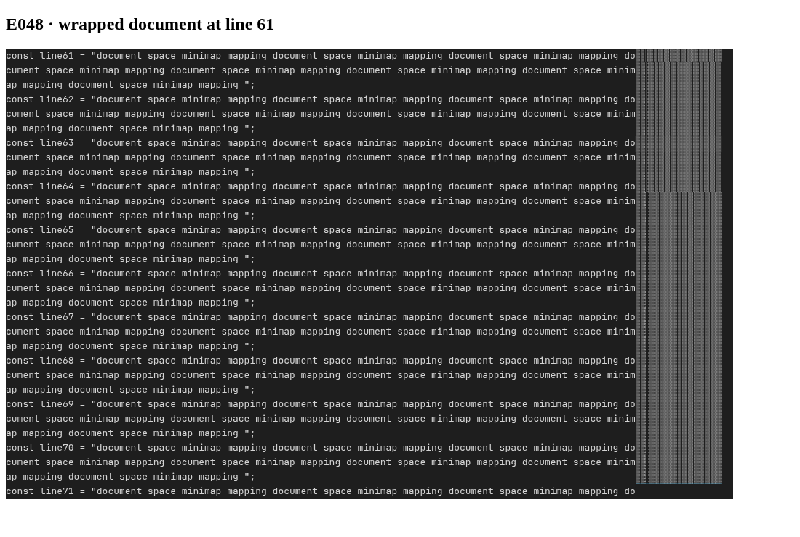

# E048: Minimap document-line mapping

Implemented 2026-09-21. Raster positioning, slider bounds, clicks and dragging now share a
zero-based document-line mapping. Visible bounds exclude injected rows and mounted overscan.
Unwrapped lines retain fractional scrolling; wrapped lines count once, including when only their
continuations are visible. Oversized collapsed spans switch to fitted rendering. Sampled rasters
now select lines across the entire document and project decorations onto the same scale.

The implementation needed one change outside `packages/minimap`: the core view method behind
`revealLine` treated its argument as a display row. It now resolves the document line through the
projection before scrolling. The browser regression covers this with wrapping enabled and checks
that navigation preserves selections.

D1: retain the worker's line-index mirror and its existing transition checks. Replacing it with a
full transferred index is unnecessary for this change and would add per-edit transfer work.

Validation: minimap unit and Chromium tests, including the 594-frame pixel oracle; minimap and
core type checks; minimap lint; repository formatting check. The stress example was opened in
Chromium with a 300-line document, word wrap enabled and three display rows per document line.
At scrollTop 3600, document line 61 is at the top; the slider starts at 120px and spans 22px for
lines 61 through 71. No page errors were reported.

