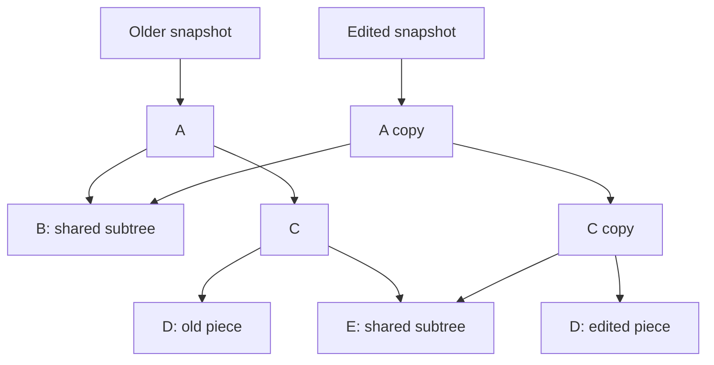
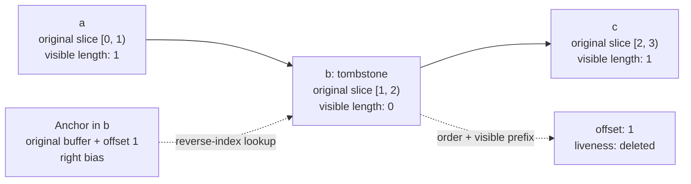

# Singapore Textbuffer

**Persistent text storage with stable anchors, two treap indexes, and copy-on-write buffers.**

Singapore's text engine is an **augmented, persistent piece tree**, not a generic treap wrapped around a string. One tree orders pieces and summarizes visible text. A second tree maps source-buffer coordinates back to those pieces. Deleted pieces remain as tombstones, so anchors retain their meaning after the text they refer to disappears.

The storage layer also includes a paged buffer store, a sequential-typing fast path, indexed line lookup, Unicode-aware edit boundaries, streaming reads, and snapshot comparison. Rendering, display measurements, selections, and undo grouping stay outside the package.

[Architecture](#storage-architecture) · [Persistence](#persistent-edits) · [Anchors](#anchors-and-tombstones) · [Text boundaries](#coordinates-and-text-boundaries) · [API](#api-and-development)

## Start with a snapshot

```ts
import {
  createPieceTableSnapshot,
  insertIntoPieceTable,
  materializePieceTableFullText,
} from '@singapore-editor/textbuffer'

const original = createPieceTableSnapshot('hello')
const edited = insertIntoPieceTable(original, 5, ' world')
const branch = insertIntoPieceTable(original, 0, 'say ')

materializePieceTableFullText(original) // 'hello'
materializePieceTableFullText(edited) // 'hello world'
materializePieceTableFullText(branch) // 'say hello'
```

An edit returns a new version. Keeping the old snapshot preserves the old document; editing that snapshot creates another branch. There is no full-document copy or replay of inverse edits just to retain a version.

## Storage architecture

A snapshot holds **two roots and a buffer version**, plus its visible length and stored piece count.


### Pieces describe text; they do not own it

A `Piece` refers to a slice of a source buffer through `buffer`, `start`, and `length`. It also carries an `order` label, its `lineBreaks` count, and a `visible` flag. Splitting a piece creates new slice records, not copies of the source text.

There are three distinct coordinate systems:

| Coordinate      | Meaning                                                                                                                                  |
| --------------- | ---------------------------------------------------------------------------------------------------------------------------------------- |
| Document offset | Position in the current **visible**, LF-normalized text, measured in UTF-16 code units.                                                  |
| Buffer offset   | Position in a particular source buffer. Anchors use this instead of a shifting document offset.                                          |
| Piece order     | Numeric label locating a piece in the tree's full sequence, including tombstones. It is not a character offset or a permanent anchor ID. |

The distinction lets the engine move through visible text while retaining the identity and ordering of deleted text. See [`pieceTableTypes.ts`](src/pieceTableTypes.ts).

### An augmented sequence treap

The main tree combines implicit-position navigation with explicit order labels. Offset operations descend using visible subtree lengths; anchor resolution uses piece order to recover a visible prefix. Each node maintains these summaries:

| Summary                              | What it counts                                                          |
| ------------------------------------ | ----------------------------------------------------------------------- |
| `subtreeLength`                      | Source-slice lengths, including tombstones.                             |
| `subtreeVisibleLength`               | Only lengths of visible pieces. This determines document offsets.       |
| `subtreePieces`                      | All stored pieces, including tombstones.                                |
| `subtreeLineBreaks`                  | Only line breaks in visible pieces.                                     |
| `subtreeMinOrder`, `subtreeMaxOrder` | The subtree's order interval, used to skip or summarize whole subtrees. |

`splitByVisibleOffset()` and `merge()` provide the sequence-editing machinery. They copy affected nodes and recompute summaries on the way back up. The tree has no parent pointers or red-black color bookkeeping.

Order labels normally leave room between neighbors: for example, an insertion between `1024` and `2048` can receive `1536`. New pieces receive labels within that gap; when the gap becomes too small, the engine relabels the sequence and rebuilds the reverse index for the new snapshot. Anchors do not store these labels, so relabeling does not require rewriting anchor objects.

Priorities are **deterministic and seedable**, rather than sampled with `Math.random()`. New-node priorities come from a hash of the seed, piece metadata, and index kind. Copied nodes retain their priorities. A split can give its new pieces different priorities, so the split path repairs the heap relationship through merging when necessary. This makes tree shapes reproducible for a given input, edit sequence, and seed, without promising a worst-case balanced height. The snapshot creation option `prioritySeed` selects the seed; its default is `0`.

Implementation: [`tree.ts`](src/tree.ts), [`orders.ts`](src/orders.ts), and [`priority.ts`](src/priority.ts).

### A persistent reverse-index treap

The second tree is keyed by **`(buffer, start)`**, not document position. Its entries retain the corresponding piece and its current order label. Unlike the sequence tree's split/merge path, this index uses keyed insertion with copy-on-write rotations and keyed deletion with merging.

An anchor lookup finds the source slice covering the anchor's buffer offset, with left/right bias deciding boundary ownership. The main tree then turns the entry's order into a visible document offset. Splits, insertions, coalescing, and deletions update both indexes in the same returned snapshot.

This is what makes durable positions practical without storing parent pointers or walking every piece for each normal anchor lookup. A linear resolver also exists as a reference implementation and as the fallback when indexed lookup misses. See [`reverseIndex.ts`](src/reverseIndex.ts) and [`anchors.ts`](src/anchors.ts).

### Copy-on-write text buffers

The original document is retained as **one source string**. Inserted text is divided into append chunks of at most **16,384 UTF-16 code units**; chunk boundaries avoid splitting surrogate pairs. The chunk store groups string references into pages of **1,024 entries**.

Appending or extending a tail copies the outer page-reference array and the affected tail page, while sharing untouched pages. It does not clone a flat map containing every buffer entry, but the outer array copy still scales with the number of pages. Extending a chunk creates a new string in the new store version, so older snapshots still see their older chunk text.

Sequential typing has a dedicated coalescing path. An insertion can extend the existing piece when that piece ends at the insertion point, refers to the newest non-original chunk, reaches the chunk's end, and still fits within the chunk limit. Both trees receive the updated piece. Eligible typing runs therefore do not create one piece per keystroke.

The chunk limit applies to **inserted chunks**, not the initial document string. See [`buffers.ts`](src/buffers.ts) and `tryCoalesceInsert()` in [`edits.ts`](src/edits.ts).

## Persistent edits

Persistence is implemented with **path-copying / copy-on-write structural sharing**. New roots reuse untouched branches; modified paths get new nodes. The same principle applies to the reverse index and paged buffer store.



This illustrates sharing, not the exact shape produced by every split or merge. Retaining a snapshot is a reference operation; performing an edit still allocates nodes, updates indexes, and may allocate text.

**Insertion** first tries tail coalescing. Otherwise it splits at the visible offset, appends text chunks, assigns piece orders, merges in the new pieces, and applies the matching reverse-index changes.

**Deletion** splits out the affected visible range, marks its pieces invisible, and merges those tombstones back into the sequence. It updates their reverse-index entries rather than forgetting them.

**Batch edits** use coordinates from the same input snapshot. The engine validates non-overlap, repairs surrogate-boundary issues against that snapshot, then applies edits from right to left so earlier offsets remain valid. `deleteFromPieceTable(snapshot, offset, length)` takes a length; batch edits and range reads use half-open `from`/`to` or `start`/`end` coordinates.

The engine supplies versions, not an undo policy. A host decides which snapshots to keep, when several edits form one undo step, and which selection state accompanies a version. See [`snapshot.ts`](src/snapshot.ts) and [`edits.ts`](src/edits.ts).

## Anchors and tombstones

A real anchor stores **a buffer ID, an offset within that buffer, and a bias**. It does not store a tree node, an order label, or the current document offset. Resolution is always against a particular snapshot and returns both `offset` and `liveness`.

Deleting `b` from `abc` produces the following **piece sequence**, not a particular balancing shape:



The visible text is `ac`, but the full piece sequence still accounts for all three source code units. The tombstone contributes zero visible length and zero visible line breaks while retaining the deleted slice's identity.

**Old snapshots and tombstones solve different problems.** Old snapshots preserve an earlier document. Tombstones let an anchor to deleted text resolve within the newer document.

Bias also matters around replacement text. A deleted anchor can stay to the left or right of the replacement while continuing to report `liveness: 'deleted'`:

```ts
import {
  anchorAt,
  createPieceTableSnapshot,
  deleteFromPieceTable,
  insertIntoPieceTable,
  resolveAnchor,
} from '@singapore-editor/textbuffer'

const original = createPieceTableSnapshot('abc')
const left = anchorAt(original, 2, 'left')
const right = anchorAt(original, 1, 'right')
const deleted = deleteFromPieceTable(original, 1, 1)
const replaced = insertIntoPieceTable(deleted, 1, 'XX') // 'aXXc'

resolveAnchor(replaced, left) // { offset: 1, liveness: 'deleted' }
resolveAnchor(replaced, right) // { offset: 3, liveness: 'deleted' }
resolveAnchor(original, right) // { offset: 1, liveness: 'live' }
```

The deleted-anchor path uses neighboring source slices and visible lengths between their order labels to account for intervening insertions. Two anchors can resolve to the same offset while having different attachment semantics. `Anchor.MIN` and `Anchor.MAX` are separate sentinels for the current document's ends.

Treat anchors as belonging to their document history, not as globally unique or cross-branch merge identifiers. Buffer IDs are sequence-based and can be reused when editing divergent snapshots. This storage engine does not provide a collaborative merge protocol.

Implementation and examples: [`anchors.ts`](src/anchors.ts) and [`pieceTable.test.ts`](src/pieceTable.test.ts).

## Coordinates and text boundaries

### Indexed line mapping

Document offsets and `Point.column` count **UTF-16 code units**. Rows and columns are zero-based; columns are not grapheme counts, tab-expanded columns, or display widths. `pointToOffset()` clamps columns to line ends and rows beyond the document to its end.

Line lookup combines the tree's visible-length/line-break summaries with **per-buffer newline-offset indexes**. Those indexes store absolute buffer offsets in growable `Uint32Array`s. Binary search counts line breaks within a piece slice or locates a particular break without rescanning the whole slice.

The original buffer's newline index is built during initial piece creation. Append indexes are built on demand and can extend as a tail chunk grows. `offsetToPoint()` also records the row start during its descent when possible, avoiding a second tree search in that case.

Document versions are persistent, but these derived indexes are **mutable memoization**, not deeply frozen snapshot data. Reuse checks the indexed text and retains indexes by chunk-store version, so a reused buffer ID from an undo branch does not silently reuse another string's line offsets.

For editor-owned sidecars, `snapshot.buffers.identity` identifies a **document lineage**, shared across versions and branches. It is not a version ID. Caches keyed by lineage and buffer ID must also validate the text they describe. See [`buffers.ts`](src/buffers.ts) and [`positions.ts`](src/positions.ts).

### LF inside, document line endings outside

`createPieceTableSnapshot()` normalizes CRLF, lone CR, U+2028, and U+2029 to LF, and records the detected line-ending preference and leading BOM separately. Detection uses a majority of terminators carrying CR; ties choose LF. With no ordinary line terminators, it uses the supplied fallback.

**Low-level edit functions expect already-normalized text.** They do not call `normalizeLineEndings()` for you. Normalize incoming text before insertion or batch application, and use the normalized length for any corresponding offset calculations.

```ts
import {
  createPieceTableSnapshot,
  insertIntoPieceTable,
  materializePieceTableFullText,
  normalizeLineEndings,
  pieceTableDocumentText,
} from '@singapore-editor/textbuffer'

const original = createPieceTableSnapshot('a\r\nb')
const inserted = normalizeLineEndings('\r\nc')
const edited = insertIntoPieceTable(original, original.length, inserted)

materializePieceTableFullText(edited) // 'a\nb\nc': internal text
pieceTableDocumentText(edited) // 'a\r\nb\r\nc': text for saving
```

Use `pieceTableDocumentText()` to restore the document's preferred line ending and, by default, its BOM. Mixed line endings are not preserved individually; lone CR and U+2028/U+2029 are not restored to their original form. `pieceTableContainsUnusualLineTerminators()` reports whether ingestion folded U+2028/U+2029. This is normalized text storage, not a byte-preserving file container.

The `normalized: true` creation option skips ingestion for callers that already hold normalized text. It is a caller guarantee, not a validation pass. See [`lineEndings.ts`](src/lineEndings.ts) and [`documentText.ts`](src/documentText.ts).

### Surrogate-aware editing, not display policy

Edit repair considers the resulting text, not just whether an endpoint falls inside a surrogate pair. It preserves valid replacements of one surrogate half by another, expands deletions that would orphan a half, and moves unsafe collapsed insertions left rather than turning them into replacements. Batch repair accounts for neighboring edits and merges overlaps introduced by snapping.

Hosts reporting edits to undo, change listeners, or incremental consumers can use `snapBatchEditRanges()` to obtain the actual applied ranges. Anchor creation also snaps an offset inside a surrogate pair to the code point's start. These rules do not implement grapheme navigation or visual cursor movement. See [`edits.ts`](src/edits.ts) and [`anchors.ts`](src/anchors.ts).

## Reading and snapshot diffs

Range reads materialize only the requested visible interval. Chunk and piece visitors expose visible ranges without first flattening the document. A stateful walker retains a traversal stack, skips wholly invisible subtrees, and supports seeking, chunk traversal, and code-unit reads. Its `codePoint()` can join a surrogate pair across a piece boundary; advancing still uses UTF-16 code units. Crossing piece boundaries still involves traversal and can encounter interleaved tombstones, even though wholly invisible subtrees can be skipped.

`diffPieceTableSnapshots(previous, next)` returns **one contiguous replacement**, or `null` for equal text. It finds a common prefix and a non-overlapping common suffix, scanning the suffix in 4,096-code-unit windows. Only the replacement payload is materialized as the returned edit's text; neither full document must be flattened first.

This is a text comparison with snapshot/root-identity shortcuts, **not** a multi-hunk diff or a changed-subtree-only algorithm. Distant changes can produce one replacement spanning the text between them, and finding matching prefixes/suffixes can still scan substantial text. See [`reads.ts`](src/reads.ts), [`walker.ts`](src/walker.ts), and [`diff.ts`](src/diff.ts).

## Costs and invariants

The unit that matters for tree work is **stored pieces, including tombstones**, not just current text length. Navigation follows the actual tree height; seeded hash priorities do not provide a hard worst-case height bound.

Retaining a snapshot is constant-time, but keeping many versions is not constant-memory. Editing also pays for inserted text, affected pieces, reverse-index updates, and buffer-store copies. Deleting a large piece range visits those pieces to mark them invisible. Exhausting an order gap triggers whole-tree relabeling and reverse-index reconstruction. Dropping an undo entry does not itself compact tombstones out of the current snapshot. A cold newline index also pays for scanning its source text before indexed lookups can reuse the result. Even a short visible document can retain a large history in its pieces and source chunks.

The main invariants are that piece slices stay within their source buffers, piece order is strictly increasing, both trees satisfy their priority heap relationship, cached summaries match their subtrees, and the reverse index describes the same pieces and orders as its snapshot's main tree. Old versions must continue to read their original text.

The inspection entry point checks buffer bounds, ordering, priorities, aggregates, line indexes, snapshot totals, and reverse-index consistency. The test suite includes string-model edit/read checks, retained snapshots, line-coordinate round trips, coalescing, and indexed-versus-linear anchor resolution.

```ts
import { createPieceTableSnapshot } from '@singapore-editor/textbuffer'
import { validatePieceTreeInvariants } from '@singapore-editor/textbuffer/debug'

const snapshot = createPieceTableSnapshot('hello\nworld')
const validation = validatePieceTreeInvariants(snapshot)
validation.issues // [] for a valid snapshot
```

Treat exposed snapshot internals as read-only even where their implementation types permit mutation. See [`inspection.ts`](src/inspection.ts), [`pieceTable.test.ts`](src/pieceTable.test.ts), and [`boundary.test.ts`](src/boundary.test.ts).

## API and development

The package is ESM with TypeScript declarations and **no runtime dependencies**. Import normal operations directly from `@singapore-editor/textbuffer`; there is no editor-side compatibility layer.

| Area                    | Main entry point                                                                                                                                                         |
| ----------------------- | ------------------------------------------------------------------------------------------------------------------------------------------------------------------------ |
| Versions and edits      | `createPieceTableSnapshot`, `insertIntoPieceTable`, `deleteFromPieceTable`, `applyBatchToPieceTable`, `snapBatchEditRanges`                                              |
| Reads                   | `readPieceTableTextRange`, `streamPieceTableTextChunks`, `streamPieceTablePieces`, `createPieceTableWalker`, `materializePieceTableFullText`                             |
| Coordinates and anchors | `offsetToPoint`, `pointToOffset`, `anchorAt`, `anchorBefore`, `anchorAfter`, `resolveAnchor`, `compareAnchors`, `Anchor`                                                 |
| Comparison              | `pieceTableSnapshotsHaveSameText`, `diffPieceTableSnapshots`                                                                                                             |
| Document I/O            | `normalizeLineEndings`, `normalizeDocumentText`, `pieceTableDocumentText`, `pieceTableLineEnding`, `pieceTableByteOrderMark`, `pieceTableContainsUnusualLineTerminators` |

`/debug` provides invariant validation and tree inspection/formatting. `/diagnostics` provides an optional, lazy, module-level diagnostic sink, disabled by default. `/internal/*` exposes implementation modules for tightly coupled integrations and tests, not a stable public contract. The complete export surface is in [`src/index.ts`](src/index.ts) and [`package.json`](package.json).

From the repository root:

```sh
bun install
cd packages/textbuffer
bun run verify
```

`verify` runs typechecking, the build, the Node-based Vitest suite, and a built-package ESM smoke test. Tests run without a DOM. Production source is typechecked without DOM or Node ambient types. Use the package scripts rather than `bun test`.
