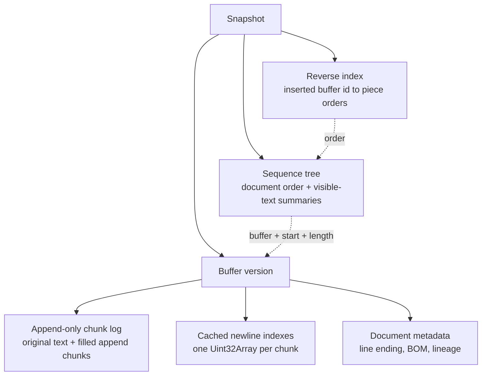
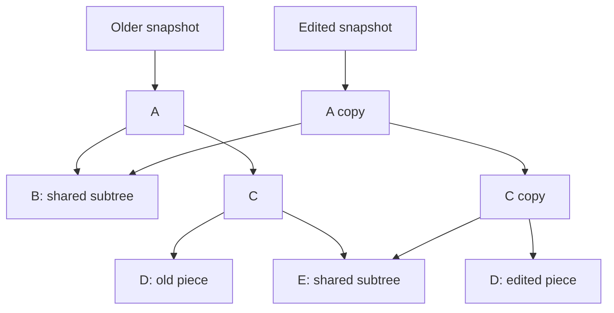
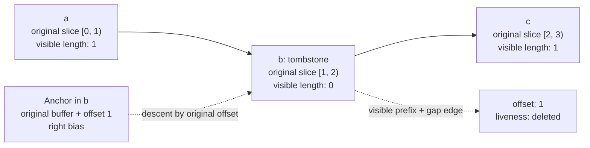

# Singapore Textbuffer

Text storage for Singapore's browser editor. It uses two persistent AVL trees and an append-only buffer log.

One tree keeps pieces in document order. The other finds them by their source-buffer coordinates. Each edit returns a new snapshot and shares unchanged data with older snapshots. Deleted pieces stay in the tree so anchors can still find them.

[Storage](#storage) · [Tree choice](#why-an-avl-tree) · [Edits](#edits-and-snapshots) · [Anchors](#anchors-and-tombstones) · [Text](#text-and-positions) · [Influences](#influences) · [Development](#development) · [Benchmarks](#benchmarks)

## Usage

```ts
import {
  createPieceTableSnapshot,
  insertIntoPieceTable,
  materializePieceTableFullText,
} from '@singapore-editor/textbuffer'

const original = createPieceTableSnapshot('hello')
const edited = insertIntoPieceTable(original, 5, ' world')
const branch = insertIntoPieceTable(original, 0, 'say ')

materializePieceTableFullText(original) // 'hello'
materializePieceTableFullText(edited) // 'hello world'
materializePieceTableFullText(branch) // 'say hello'
```

Keep a snapshot to keep that version of the document. Edit an older snapshot to create a branch.

## Storage

A snapshot holds the sequence tree's root, a reverse index, a buffer version, the visible text length, and the stored piece count.



### Pieces

A `Piece` describes a slice of a string: `buffer`, `start`, and `length`. It also stores its `order`, `lineBreaks`, `visible` flag, and `firstLineBreak`: where its breaks begin in its chunk's newline index, so a lookup inside the piece reads that index without searching the whole chunk. Splitting a piece creates two records that refer to the same source string.

| Coordinate      | Meaning                                                     |
| --------------- | ----------------------------------------------------------- |
| Document offset | Position in the current visible text, in UTF-16 code units. |
| Buffer offset   | Position in a source string. Anchors store this.            |
| Piece order     | A numeric label that orders pieces, including deleted ones. |

See [`pieceTableTypes.ts`](src/pieceTableTypes.ts).

### The sequence tree

Each node holds one piece and summaries of its subtree:

| Field                                | Meaning                                                        |
| ------------------------------------ | -------------------------------------------------------------- |
| `subtreeOriginalLength`              | Length of the original buffer's pieces, deleted ones included. |
| `subtreeVisibleLength`               | Length of the visible text.                                    |
| `subtreePieces`                      | Number of stored pieces.                                       |
| `subtreeLineBreaks`                  | Number of visible line breaks.                                 |
| `subtreeMinOrder`, `subtreeMaxOrder` | The subtree's order range.                                     |
| `subtreeMinBuffer`                   | The oldest buffer id in the subtree.                           |

Offset lookups use visible lengths to choose a branch. Line lookups use line-break counts. Anchor resolution descends by order, by original length for an anchor in the original text, and by oldest buffer to find the edges of a deleted piece's gap.

New pieces get order labels between their neighbors. For example, a piece between `1024` and `2048` can get `1536`. When the gap becomes too small, the engine relabels the sequence and rebuilds the reverse index. Anchors keep their buffer coordinates through this change.

The sequence tree is an AVL tree: every node stores its height and sibling heights differ by at most one, so the height stays under `1.45 log2(P + 2)` for `P` pieces. The same input and edits always produce the same shape; there is no seed.

See [`tree.ts`](src/tree.ts), [`join.ts`](src/join.ts), [`node.ts`](src/node.ts), and [`orders.ts`](src/orders.ts).

### Why an AVL tree?

Deleted text stays in the tree as tombstones, so **an edit never removes a piece**; only [maintenance](#compaction) shrinks the tree. An edit therefore needs no split and no merge. An insert descends once, places its pieces beside or inside the landing piece, and rejoins each node on the way back up. A delete descends once, hides the range in place, and cuts only the two pieces its ends fall inside. Each rejoin is a `join` of two subtrees whose heights differ by at most two, which is a constant number of rotations. An edit path-copies one root-to-leaf path and nothing else.

The tree was a treap until [E040](../../docs/performance/e040-balanced-tree.md). That measurement compared the treap, AVL and weight-balanced trees, each edited through split and join and through one descent. The balance rule barely mattered; a balanced tree driven through split and join was slower than the treap, and the one-descent edits were a quarter to a third faster under either rule. AVL was marginally ahead and its invariant is the simpler one to validate.

### The reverse index

An anchor names a buffer and an offset in it. Resolving one means finding the piece that holds that offset, and then that piece's place in the document. Two facts make this cheap:

- **A buffer's pieces keep their buffer order in the document.** Pieces are cut and hidden, never moved. Compaction drops tombstones, and their entries then lead to a stand-in.
- **Whatever sits between two pieces of one buffer is newer than they are.** It was inserted into that buffer's text, so its buffer id is larger.

**The original buffer needs no index.** Its pieces tile the original text in document order, so `subtreeOriginalLength` is a prefix sum over original offsets. One descent finds the piece holding an original offset and the visible length before it. This is the buffer that random edits cut, so those cuts write nothing.

**Inserted buffers go in a persistent vector keyed by buffer id.** Ids are dense and the newest is always the next one, so a new buffer is an append. The vector's tail is shared along a linear history: the first snapshot to append after its parent writes the tail's free slot in place and copies nothing, because older snapshots never read past their own count. A second branch from the same parent takes a private tail. Every 16 appends the full tail becomes a leaf, which copies one short path.

A slot holds **the order of the buffer's only piece**, or a small AVL tree of `start → order` once the buffer has been cut. It holds nothing else. Visibility and length live on the piece in the sequence tree, where the descent by order finds them, so hiding a piece and typing onto the end of one change no entry. Only a new key writes: inserted text, and the later parts of a cut in an inserted buffer.

A relabel changes every order, so the index is rebuilt from one walk of the tree, and the entries that lead to stand-ins are carried over from the index before it. `resolveAnchorLinear` is the reference: it uses no summaries and only the pieces in order, asking the index only where a compacted anchor's stand-in is. The inspector checks the two facts above, one entry per inserted piece or stand-in, and each entry's order.

[E039](../../docs/performance/e039-reverse-index-cost.md) records the measurements behind this. Until then the index was a second AVL tree keyed by `(buffer, start)` whose entries mirrored whole pieces. An insert copied 20 of its nodes against 10 in the sequence tree, and a keystroke rewrote its deepest entry. A per-buffer tree inside the vector, the design first planned, kept the original buffer's tree and was within 7% of that baseline on random edits. Deferring the writes to the first resolution was not built: an editor resolves its selections after every edit, so there would be nothing to batch.

See [`reverseIndex.ts`](src/reverseIndex.ts) and [`anchors.ts`](src/anchors.ts).

### The append-only buffer log

The original document stays in one string, chunk 0. Inserted text goes into append chunks of up to **16,384 UTF-16 code units**. An insert fills the newest chunk while it has room and opens a new chunk only when it is full, so chunk count grows with inserted text, not with edit count. Chunk boundaries keep surrogate pairs and CRLF together.

Every buffer id names one contiguous span of one chunk. A fill is one buffer, each chunk opened after it is another, so `(buffer, start)` stays the insertion identity that the reverse index and anchors are keyed by: the pieces of one insert are neighbours in that key space and the pieces of the previous insert, which may sit right before them in the same chunk string, are not.

All snapshots of a lineage share one log: the array of chunk strings and the map from buffer id to chunk. Each snapshot records the extent it may see — chunk count, tail length and buffer count. Appending compares the log against the extent. Equal means this snapshot is the newest and the append happens in place; longer means another branch, or an undone one re-minting the same ids, already appended, so the snapshot copies its visible prefix into a fresh log and continues there. One copy per branch point, none on a linear history.

Sequential typing can extend an existing piece. The piece must end at the insertion point, be the newest buffer, reach the end of its chunk, and fit within the chunk limit after the edit. This lets a typing run share one piece across several keystrokes.

See [`buffers.ts`](src/buffers.ts) and `tryCoalesceInsert()` in [`edits.ts`](src/edits.ts).

## Edits and snapshots

Edits copy changed paths and share untouched branches. Both tree indexes use this approach.



This example shows shared and copied nodes. The resulting shape depends on the edit and priorities.

**One call, one pass:** every edit of a call writes with one epoch, the reverse index is written once at the end, and only the final snapshot exists. A replacement hides its range and places its text on the same descent.

**Insert:** descend to the last visible piece ending at the offset, so text never lands between two tombstones. Extend the newest append piece if it ends there. Otherwise fill or open chunks, assign orders, place the pieces at the landing, cutting its piece in two if the offset is inside it, and append the new buffers to the reverse index.

**Delete:** descend over the range, mark the pieces inside it invisible in place, and cut the pieces its two ends fall inside. Only a cut inside an inserted buffer touches the reverse index.

**Batch edit:** validate disjoint ranges against the input snapshot, repair surrogate boundaries, then apply edits from right to left. `deleteFromPieceTable()` takes an offset and length. Batch edits and range reads use half-open ranges.

The editor chooses which snapshots to keep and how to group undo steps. It also owns selections, rendering, and display measurements.

See [`snapshot.ts`](src/snapshot.ts) and [`edits.ts`](src/edits.ts).

## Anchors and tombstones

An anchor stores **a buffer ID, an offset in that buffer, and a left/right bias**. Resolving it against a snapshot returns a visible offset and `live` or `deleted` liveness.

Deleting `b` from `abc` leaves this piece sequence:



The visible text is `ac`. The deleted piece still identifies `b`, but contributes zero visible length and zero visible line breaks.

Old snapshots preserve earlier text. Tombstones preserve the location of deleted text in newer snapshots. Bias places a deleted anchor on the left or right of replacement text:

```ts
import {
  anchorAt,
  createPieceTableSnapshot,
  deleteFromPieceTable,
  insertIntoPieceTable,
  resolveAnchor,
} from '@singapore-editor/textbuffer'

const original = createPieceTableSnapshot('abc')
const left = anchorAt(original, 2, 'left')
const right = anchorAt(original, 1, 'right')
const deleted = deleteFromPieceTable(original, 1, 1)
const replaced = insertIntoPieceTable(deleted, 1, 'XX') // 'aXXc'

resolveAnchor(replaced, left) // { offset: 1, liveness: 'deleted' }
resolveAnchor(replaced, right) // { offset: 3, liveness: 'deleted' }
resolveAnchor(original, right) // { offset: 1, liveness: 'live' }
```

A deleted piece's gap reaches, on each side, to the nearest piece whose buffer is no newer than its own: another part of the same insert, or text that was already there when it was inserted. Everything between arrived later. A left-biased anchor resolves before that later text and a right-biased one after it. An insert lands after the last visible piece ending at its offset and a replacement where its hidden text began, so neither goes between two tombstones and the result never depends on the tree's shape. `Anchor.MIN` and `Anchor.MAX` always resolve to the document's ends.

Use anchors within the document history that created them. Branches can reuse sequence-based buffer IDs. Cross-branch merging needs its own identity and merge rules.

See [`anchors.ts`](src/anchors.ts) and [`pieceTable.test.ts`](src/pieceTable.test.ts).

### Compaction

A run of adjacent tombstones only answers where a deleted anchor's gap scan stops. Since no text ever lands inside the run, each scan can stop in only a few ways a later edit can tell apart: inside the run, at a visible piece, inside another run, or past a document end. `compactTombstones` replaces each run with one tombstone per way both scans end, and leads the dropped tombstones' reverse-index entries to them. These **stand-ins** hold no text, and their buffer field is a threshold rather than an id. Original tombstones merge but stay pieces, because original anchors are found by summing their lengths. Every arrangement is checked against the run before it is published, and a run that fails is kept.

Every anchor resolves exactly as it did, in the compacted snapshot and in every snapshot edited from it. The snapshot object, its text and its visible pieces stay the same. A differential test holds an uncompacted control beside every compaction. The editor runs the pass on its current snapshot during quiet time; history keeps the trees it recorded until it moves past them. What still grows with edit count is a reverse-index slot and a chunk-map entry per insertion ever made, about 22 bytes together, and a table row per stand-in identity. See the [E006 report](../../docs/storage/e006-tombstone-compaction.md).

See [`compaction.ts`](src/compaction.ts).

## Text and positions

### Line lookup

Offsets and columns count **UTF-16 code units**. Rows and columns start at zero. `pointToOffset()` clamps columns to the line end and out-of-range rows to the document's bounds. Grapheme navigation, tab widths, and screen coordinates belong to the editor.

Line lookup combines subtree summaries with per-chunk newline indexes. These store offsets in growable `Uint32Array`s. A piece knows where its own breaks begin in its chunk's index, so its K-th break is an array read and a count inside it searches only its own entries.

`lineRange()` returns a row's start and end from one descent: the break that ends the row is in the piece the descent lands in, or it is the first break after it. `pointToOffset()` and `readPieceTableLine()` are built on it, and a row that lies inside one piece is sliced straight from that piece's chunk.

The original string is indexed on load. Append indexes are built when needed and extended as chunks grow. `offsetToPoint()` also records the row start during its descent when possible.

These indexes are mutable caches. They check the source text and retain entries by chunk-store version, so older versions and branches can reuse the correct index. `snapshot.buffers.identity` identifies a document lineage shared by its versions. Host caches keyed by lineage and buffer ID must also check the text.

See [`positions.ts`](src/positions.ts) and [`buffers.ts`](src/buffers.ts).

### Line endings

`createPieceTableSnapshot()` converts CRLF, lone CR, U+2028, and U+2029 to LF. It records the detected line-ending preference and leading BOM separately.

**Normalize incoming edit text with `normalizeLineEndings()` before calling insert or batch-edit functions.** Those functions expect LF-normalized input. Use the normalized text's length for related offset calculations.

```ts
import {
  createPieceTableSnapshot,
  insertIntoPieceTable,
  materializePieceTableFullText,
  normalizeLineEndings,
  pieceTableDocumentText,
} from '@singapore-editor/textbuffer'

const original = createPieceTableSnapshot('a\r\nb')
const inserted = normalizeLineEndings('\r\nc')
const edited = insertIntoPieceTable(original, original.length, inserted)

materializePieceTableFullText(edited) // 'a\nb\nc': internal text
pieceTableDocumentText(edited) // 'a\r\nb\r\nc': text for saving
```

Export uses one line-ending style throughout and restores the BOM by default. Mixed endings become uniform. Lone CR and U+2028/U+2029 become ordinary line breaks; `pieceTableContainsUnusualLineTerminators()` reports whether loading folded U+2028/U+2029.

Detection chooses CRLF when a majority of ordinary terminators carry CR; ties choose LF. Text with zero ordinary terminators uses the supplied fallback. The `normalized: true` creation option trusts the caller and skips normalization.

See [`lineEndings.ts`](src/lineEndings.ts) and [`documentText.ts`](src/documentText.ts).

### Unicode edit boundaries

Edit repair checks whether the resulting text would leave half a surrogate pair behind. It expands unsafe deletion ranges, shifts unsafe insertion points left, and preserves replacements that keep a valid pair. Batch repair accounts for neighboring edits and merges overlaps caused by snapping.

A document that has never held a surrogate code unit skips all of this: the buffers carry a `containsSurrogates` flag, set at load or by the first insert that brings one and never cleared, because deleted text stays as a tombstone an undo can restore. A single range edit checks its two ends on the pass that hides the range, with no descent of its own.

Use `snapBatchEditRanges()` when change listeners or undo logic need the exact applied ranges. Anchor creation also moves offsets inside a surrogate pair to its start.

See [`edits.ts`](src/edits.ts).

## Reads and diffs

Range reads return the requested visible text. Chunk and piece visitors read it in sections. The walker keeps a traversal stack and supports seeks, code-unit reads, and chunk traversal. It skips wholly invisible subtrees; crossing a boundary can still visit interleaved tombstones. `codePoint()` can join a surrogate pair across pieces.

`diffPieceTableSnapshots()` returns **one replacement** or `null`. It finds a common prefix and suffix, reading the suffix in 4,096-code-unit windows, then collects the replacement text. Changes far apart produce a replacement spanning both. The comparison can scan large matching regions and uses snapshot/root identity to skip equal versions.

See [`reads.ts`](src/reads.ts), [`walker.ts`](src/walker.ts), and [`diff.ts`](src/diff.ts).

## Costs and checks

Tree work depends on the number of stored pieces, including tombstones, and the tree height. Keeping a snapshot reference is constant-time. Keeping versions retains their nodes and caches; the buffer log is shared, and a version keeps only the extent it can see.

Deletion visits the affected pieces. Order-gap exhaustion relabels the tree and rebuilds the reverse index. A cold line index scans its source string. Tombstones stay in a snapshot until maintenance compacts them; older snapshots keep theirs.

The inspector checks buffer bounds, the store extent, order labels, balance, subtree totals, newline indexes, the order of each buffer's pieces, and agreement between the tree and the reverse index:

```ts
import { createPieceTableSnapshot } from '@singapore-editor/textbuffer'
import { validatePieceTreeInvariants } from '@singapore-editor/textbuffer/debug'

const snapshot = createPieceTableSnapshot('hello\nworld')
const validation = validatePieceTreeInvariants(snapshot)
validation.issues // [] for a valid snapshot
```

Treat snapshot internals as read-only. See [`inspection.ts`](src/inspection.ts) and [`boundary.test.ts`](src/boundary.test.ts).

## Influences

**[Fred / fredbuf](https://github.com/cdacamar/fredbuf)** by Cameron DaCamara. His [Text Editor Data Structures](https://cdacamar.github.io/data%20structures/algorithms/benchmarking/text%20editors/c++/editor-data-structures/) article was a key inspiration. Fredbuf adapts VS Code's piece-tree approach into a persistent red-black tree with copy-on-write paths. The article covers snapshots, traversal, debugging, and the work involved in persistent tree deletion.

**[Zed](https://github.com/zed-industries/zed)** inspired the stable-anchor and tombstone model. Its [text coordinate systems article](https://zed.dev/blog/zed-decoded-text-coordinate-systems#anchors) explains how anchors keep referring to text through edits and deletion.

**[VS Code](https://github.com/microsoft/vscode-textbuffer)** inspired the piece-tree layout and buffer-level line indexes. The team's [Text Buffer Reimplementation](https://code.visualstudio.com/blogs/2018/03/23/text-buffer-reimplementation) article explains those choices.

## Development

The package ships as ESM with TypeScript declarations and zero runtime dependencies. Import its API from `@singapore-editor/textbuffer`. See [`src/index.ts`](src/index.ts) for the exports.

`/debug` provides inspection and formatting helpers. `/diagnostics` provides an optional, lazy diagnostic sink, disabled by default. `/internal/*` exposes implementation details for integrations and tests; these may change between releases.

From the repository root:

```sh
bun install
cd packages/textbuffer
bun run verify
```

`verify` runs typechecking, the build, the Node-based Vitest suite, and a built-package smoke test. Run tests through `bun run test`. See [`package.json`](package.json) for the scripts.

## Benchmarks

Run `bun run bench:check`, then `bun run bench -- --profile standard` from this directory. The [benchmark guide](bench/README.md) documents the pinned Microsoft control, the shared workloads, adapter costs, correctness checks, process isolation, retained-memory measurements and the result format. Results land in `bench/results/`.

`bun run bench:profile` attributes cost with separate CPU, allocation, GC and structural-counter passes; see [`bench/PROFILING.md`](bench/PROFILING.md) and the [initial attribution](bench/ATTRIBUTION.md). `bun run bench:height` replays edit traces and samples both trees' shape; see [`bench/HEIGHT.md`](bench/HEIGHT.md). Persistence and anchors have Singapore-only lanes. This measures the standalone buffers on Node, not editor or browser rendering.

### Current results

Measured against the pinned `vscode-textbuffer`, which mutates in place and has no snapshots, no anchors and no tombstones. Singapore does that extra work in every row below, so a ratio compares unequal feature sets.

**At a glance.** Faster at loading, typing, large pastes, range reads and offset-to-position. 1.2x to 1.6x slower on line reads and position-to-offset. 1.3x to 2x slower on random edits, where persistence, tombstones and the anchor index cost the most.

How to read the tables:

- **Control** and **Singapore** are milliseconds for the whole workload. **Per operation** is Singapore's time divided by the operation count.
- **Cold** compares the two after 2 warmup runs, the bench's default. **Warm** compares them after 8, closer to a long session. Each compares against the control from the same regime, because the control warms up too. "same" means within 5%.
- The name in `code` is the lane, for `bun run bench -- --only <lane>`.

**Loading**

| Workload                                                  | Control | Singapore | Per operation | Cold            | Warm            |
| --------------------------------------------------------- | ------: | --------: | ------------: | --------------- | --------------- |
| Load 1.5M code units of short lines<br>`load-short-lines` | 3.75 ms |   2.15 ms |       2.15 ms | **1.7x faster** | **1.3x faster** |
| Load 1.3M code units on one line<br>`load-long-line`      | 2.87 ms |   1.06 ms |       1.06 ms | **2.7x faster** | **1.2x faster** |

**Editing**

| Workload                                                                         |  Control | Singapore | Per operation | Cold            | Warm            |
| -------------------------------------------------------------------------------- | -------: | --------: | ------------: | --------------- | --------------- |
| Type 1,500 characters at one caret<br>`sequential-typing`                        |  0.61 ms |   0.40 ms |       0.27 µs | **1.5x faster** | same            |
| The same, with a caret row and column lookup after each<br>`typing-with-lookups` |  0.96 ms |   0.62 ms |       0.21 µs | **1.5x faster** | **1.4x faster** |
| 1,500 inserts at random offsets<br>`random-insertions`                           |  1.09 ms |   1.40 ms |       0.94 µs | 1.3x slower     | 1.3x slower     |
| 1,500 replacements at random offsets<br>`random-replacements`                    |  1.38 ms |   2.74 ms |       1.82 µs | 2.0x slower     | 1.5x slower     |
| The same in an ASCII-only document<br>`ascii-replacements`                       |  1.37 ms |   2.53 ms |       1.69 µs | 1.8x slower     | 1.5x slower     |
| 187 batches of 8 cursors<br>`eight-cursor-batches`                               |  1.16 ms |   1.78 ms |       9.51 µs | 1.5x slower     | 1.5x slower     |
| 1,500 mixed inserts, deletes and replacements<br>`mixed-edit-churn`              |  1.22 ms |   2.36 ms |       1.57 µs | 1.9x slower     | 1.8x slower     |
| Paste 256,000 code units and delete them, 16 times<br>`large-paste-delete`       | 12.67 ms |   4.64 ms |        145 µs | **2.7x faster** | **2.7x faster** |

**Reading, after 1,500 edits**

| Workload                                                 | Control | Singapore | Per operation | Cold            | Warm            |
| -------------------------------------------------------- | ------: | --------: | ------------: | --------------- | --------------- |
| 3,000 lines in order<br>`lines-sequential-after-churn`   | 0.50 ms |   0.69 ms |       0.23 µs | 1.4x slower     | 1.6x slower     |
| 3,000 lines at random<br>`lines-random-after-churn`      | 0.77 ms |   0.93 ms |       0.31 µs | 1.2x slower     | 1.3x slower     |
| 3,000 offset ranges<br>`ranges-after-churn`              | 3.07 ms |   1.31 ms |       0.44 µs | **2.3x faster** | **2.4x faster** |
| 3,000 offsets to row and column<br>`offset-to-position`  | 1.63 ms |   0.77 ms |       0.26 µs | **2.1x faster** | **1.1x faster** |
| 3,000 rows and columns to offset<br>`position-to-offset` | 0.41 ms |   0.59 ms |       0.20 µs | 1.5x slower     | 1.6x slower     |
| The whole document, 12 times<br>`full-read-after-churn`  | 1.29 ms |   2.04 ms |        170 µs | 1.6x slower     | 1.4x slower     |

**What the control cannot do**

| Workload                                                                      |     Cold |     Warm | Per operation |
| ----------------------------------------------------------------------------- | -------: | -------: | ------------: |
| 1,500 edits, keeping 64 old versions alive<br>`persistent-history`            |  2.51 ms |  2.03 ms |       1.67 µs |
| 64 branches from one version, one insert each<br>`branch-edits`               |  0.28 ms |  0.22 ms |       4.31 µs |
| 3,000 anchor resolutions after 1,500 edits<br>`anchor-resolution-after-churn` |  0.49 ms |  0.31 ms |       0.16 µs |
| 300 edits, resolving 500 anchors after each<br>`anchor-density`               | 10.58 ms | 11.22 ms |         35 µs |

Read lanes run after a 1,500-edit churn that leaves about twice as many pieces in Singapore's tree, because deleted text stays as tombstones. Line reads are one `readPieceTableLine` call; the control has a cached `getLineContent`, which is most of what is left of the sequential lane's gap. `anchor-density` has two modes about 10% apart, and which build lands in the slower one changes with the warmup count; see the [E046 report](../../docs/performance/e046-one-walk-rows-and-cuts.md).

Setup: E046, 2026-09-17, Node 26.7.0, V8 14.6, Intel Core i7-14700K, Linux. Standard profile: a 380,000 UTF-16 code unit document of 10,000 lines unless the row says otherwise, 9 samples per lane, each a fresh process, median over seeds `20260916`, `7` and `12345`. These are synthetic traces on one machine; rerun before quoting them elsewhere.
