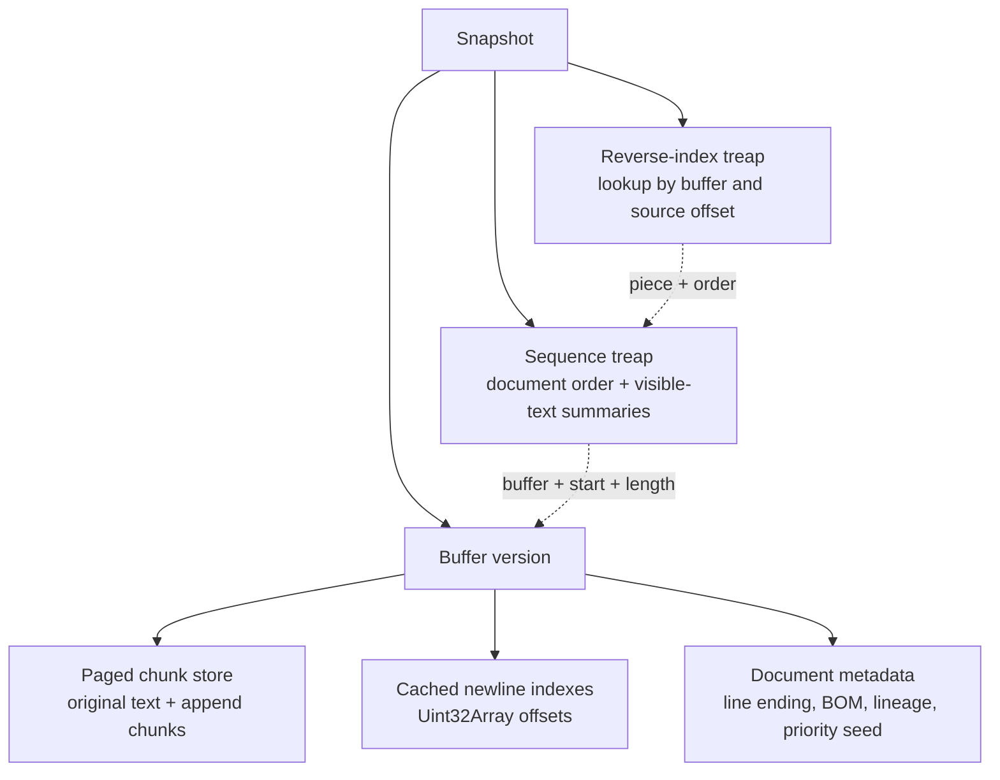
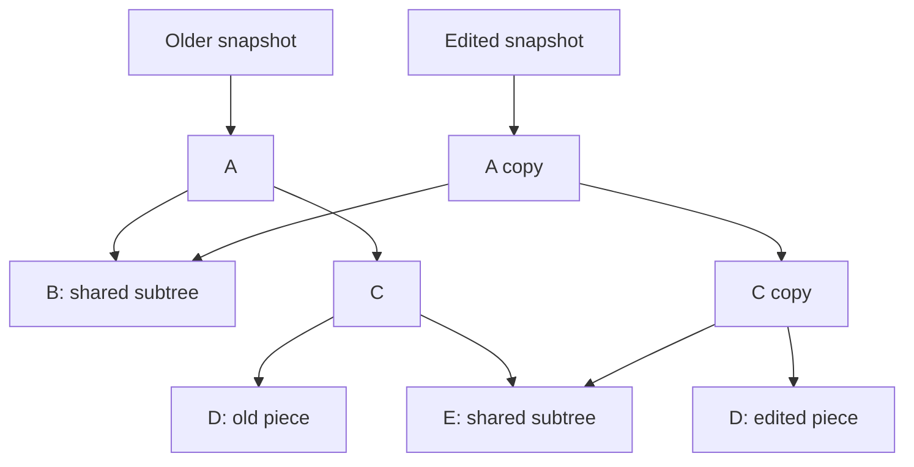
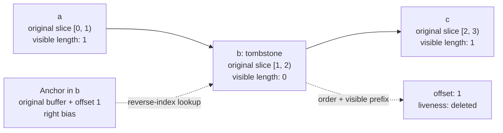

# Singapore Textbuffer

Text storage for Singapore's browser editor. It uses two persistent treaps and copy-on-write buffers.

One tree keeps pieces in document order. The other finds them by their source-buffer coordinates. Each edit returns a new snapshot and shares unchanged data with older snapshots. Deleted pieces stay in the tree so anchors can still find them.

[Storage](#storage) · [Tree choice](#why-a-treap) · [Edits](#edits-and-snapshots) · [Anchors](#anchors-and-tombstones) · [Text](#text-and-positions) · [Influences](#influences) · [Development](#development) · [Benchmarks](#benchmarks)

## Usage

```ts
import {
  createPieceTableSnapshot,
  insertIntoPieceTable,
  materializePieceTableFullText,
} from '@singapore-editor/textbuffer'

const original = createPieceTableSnapshot('hello')
const edited = insertIntoPieceTable(original, 5, ' world')
const branch = insertIntoPieceTable(original, 0, 'say ')

materializePieceTableFullText(original) // 'hello'
materializePieceTableFullText(edited) // 'hello world'
materializePieceTableFullText(branch) // 'say hello'
```

Keep a snapshot to keep that version of the document. Edit an older snapshot to create a branch.

## Storage

A snapshot holds two tree roots, a buffer version, the visible text length, and the stored piece count.



### Pieces

A `Piece` describes a slice of a string: `buffer`, `start`, and `length`. It also stores its `order`, `lineBreaks`, and `visible` flag. Splitting a piece creates two records that refer to the same source string.

| Coordinate      | Meaning                                                     |
| --------------- | ----------------------------------------------------------- |
| Document offset | Position in the current visible text, in UTF-16 code units. |
| Buffer offset   | Position in a source string. Anchors store this.            |
| Piece order     | A numeric label that orders pieces, including deleted ones. |

See [`pieceTableTypes.ts`](src/pieceTableTypes.ts).

### The sequence tree

Each node holds one piece and summaries of its subtree:

| Field                                | Meaning                                       |
| ------------------------------------ | --------------------------------------------- |
| `subtreeLength`                      | Total slice length, including deleted pieces. |
| `subtreeVisibleLength`               | Length of the visible text.                   |
| `subtreePieces`                      | Number of stored pieces.                      |
| `subtreeLineBreaks`                  | Number of visible line breaks.                |
| `subtreeMinOrder`, `subtreeMaxOrder` | The subtree's order range.                    |

Offset lookups use visible lengths to choose a branch. Line lookups use line-break counts. Order ranges let anchor resolution skip or sum whole subtrees.

New pieces get order labels between their neighbors. For example, a piece between `1024` and `2048` can get `1536`. When the gap becomes too small, the engine relabels the sequence and rebuilds the reverse index. Anchors keep their buffer coordinates through this change.

Node priorities come from a hash of piece metadata, the index kind, and `prioritySeed`, which defaults to `0`. The same input, edits, and seed produce the same tree shape. Copied nodes keep their priorities. Splitting a piece creates fresh priorities; the split path uses merging to repair the heap order when needed.

See [`tree.ts`](src/tree.ts), [`orders.ts`](src/orders.ts), and [`priority.ts`](src/priority.ts).

### Why a treap?

We chose a treap because **split and merge fit our edits**. They also make path-copying and updating subtree totals straightforward. The sequence tree uses these operations; the reverse index uses keyed insertion, copy-on-write rotations, and merging on deletion.

A red-black tree uses colors and rotations to guarantee `O(log P)` height for `P` pieces. Both tree types support persistent versions. A treap's expected logarithmic height depends on its priority distribution. Our seeded hashes make the structure reproducible, while worst-case height can reach `O(P)`.

The tradeoff is simpler sequence-editing code in exchange for weaker worst-case balance guarantees. Text allocation, indexing, and retained history also affect performance.

### The reverse index

The second tree is keyed by **`(buffer, start)`**. Each entry holds a piece and its current order label.

Anchor resolution first finds the piece containing the anchor's buffer offset. It then uses the piece's order to find its visible position in the sequence tree. Bias decides which piece owns a shared boundary.

Edits update both trees together. A linear resolver serves as a test reference and handles indexed lookup misses.

See [`reverseIndex.ts`](src/reverseIndex.ts) and [`anchors.ts`](src/anchors.ts).

### Copy-on-write buffers

The original document stays in one string. Inserted text goes into chunks of up to **16,384 UTF-16 code units**. Chunk boundaries keep surrogate pairs together. The store groups string references into pages of **1,024 entries**.

Appending copies the outer page array and the affected tail page. The other pages are shared. Extending a tail chunk creates a new string, so older snapshots keep seeing their original text. Copying the outer array costs more as the page count grows.

Sequential typing can extend an existing piece. The piece must end at the insertion point, reach the end of the newest append chunk, and fit within the chunk limit after the edit. This lets a typing run share one piece across several keystrokes.

See [`buffers.ts`](src/buffers.ts) and `tryCoalesceInsert()` in [`edits.ts`](src/edits.ts).

## Edits and snapshots

Edits copy changed paths and share untouched branches. Both tree indexes use this approach.



This example shows shared and copied nodes. The resulting shape depends on the edit and priorities.

**Insert:** try extending the newest append piece. Otherwise split at the offset, append chunks, assign orders, merge the pieces, and update the reverse index.

**Delete:** split out the range, mark its pieces invisible, merge them back, and update their index entries.

**Batch edit:** validate disjoint ranges against the input snapshot, repair surrogate boundaries, then apply edits from right to left. `deleteFromPieceTable()` takes an offset and length. Batch edits and range reads use half-open ranges.

The editor chooses which snapshots to keep and how to group undo steps. It also owns selections, rendering, and display measurements.

See [`snapshot.ts`](src/snapshot.ts) and [`edits.ts`](src/edits.ts).

## Anchors and tombstones

An anchor stores **a buffer ID, an offset in that buffer, and a left/right bias**. Resolving it against a snapshot returns a visible offset and `live` or `deleted` liveness.

Deleting `b` from `abc` leaves this piece sequence:



The visible text is `ac`. The deleted piece still identifies `b`, but contributes zero visible length and zero visible line breaks.

Old snapshots preserve earlier text. Tombstones preserve the location of deleted text in newer snapshots. Bias places a deleted anchor on the left or right of replacement text:

```ts
import {
  anchorAt,
  createPieceTableSnapshot,
  deleteFromPieceTable,
  insertIntoPieceTable,
  resolveAnchor,
} from '@singapore-editor/textbuffer'

const original = createPieceTableSnapshot('abc')
const left = anchorAt(original, 2, 'left')
const right = anchorAt(original, 1, 'right')
const deleted = deleteFromPieceTable(original, 1, 1)
const replaced = insertIntoPieceTable(deleted, 1, 'XX') // 'aXXc'

resolveAnchor(replaced, left) // { offset: 1, liveness: 'deleted' }
resolveAnchor(replaced, right) // { offset: 3, liveness: 'deleted' }
resolveAnchor(original, right) // { offset: 1, liveness: 'live' }
```

The resolver uses neighboring source slices and visible lengths between their orders to handle intervening insertions. `Anchor.MIN` and `Anchor.MAX` always resolve to the document's ends.

Use anchors within the document history that created them. Branches can reuse sequence-based buffer IDs. Cross-branch merging needs its own identity and merge rules.

See [`anchors.ts`](src/anchors.ts) and [`pieceTable.test.ts`](src/pieceTable.test.ts).

## Text and positions

### Line lookup

Offsets and columns count **UTF-16 code units**. Rows and columns start at zero. `pointToOffset()` clamps columns to the line end and out-of-range rows to the document's bounds. Grapheme navigation, tab widths, and screen coordinates belong to the editor.

Line lookup combines subtree summaries with per-buffer newline indexes. These store offsets in growable `Uint32Array`s and use binary search to locate line breaks within a slice.

The original string is indexed on load. Append indexes are built when needed and extended as chunks grow. `offsetToPoint()` also records the row start during its descent when possible.

These indexes are mutable caches. They check the source text and retain entries by chunk-store version, so older versions and branches can reuse the correct index. `snapshot.buffers.identity` identifies a document lineage shared by its versions. Host caches keyed by lineage and buffer ID must also check the text.

See [`positions.ts`](src/positions.ts) and [`buffers.ts`](src/buffers.ts).

### Line endings

`createPieceTableSnapshot()` converts CRLF, lone CR, U+2028, and U+2029 to LF. It records the detected line-ending preference and leading BOM separately.

**Normalize incoming edit text with `normalizeLineEndings()` before calling insert or batch-edit functions.** Those functions expect LF-normalized input. Use the normalized text's length for related offset calculations.

```ts
import {
  createPieceTableSnapshot,
  insertIntoPieceTable,
  materializePieceTableFullText,
  normalizeLineEndings,
  pieceTableDocumentText,
} from '@singapore-editor/textbuffer'

const original = createPieceTableSnapshot('a\r\nb')
const inserted = normalizeLineEndings('\r\nc')
const edited = insertIntoPieceTable(original, original.length, inserted)

materializePieceTableFullText(edited) // 'a\nb\nc': internal text
pieceTableDocumentText(edited) // 'a\r\nb\r\nc': text for saving
```

Export uses one line-ending style throughout and restores the BOM by default. Mixed endings become uniform. Lone CR and U+2028/U+2029 become ordinary line breaks; `pieceTableContainsUnusualLineTerminators()` reports whether loading folded U+2028/U+2029.

Detection chooses CRLF when a majority of ordinary terminators carry CR; ties choose LF. Text with zero ordinary terminators uses the supplied fallback. The `normalized: true` creation option trusts the caller and skips normalization.

See [`lineEndings.ts`](src/lineEndings.ts) and [`documentText.ts`](src/documentText.ts).

### Unicode edit boundaries

Edit repair checks whether the resulting text would leave half a surrogate pair behind. It expands unsafe deletion ranges, shifts unsafe insertion points left, and preserves replacements that keep a valid pair. Batch repair accounts for neighboring edits and merges overlaps caused by snapping.

Use `snapBatchEditRanges()` when change listeners or undo logic need the exact applied ranges. Anchor creation also moves offsets inside a surrogate pair to its start.

See [`edits.ts`](src/edits.ts).

## Reads and diffs

Range reads return the requested visible text. Chunk and piece visitors read it in sections. The walker keeps a traversal stack and supports seeks, code-unit reads, and chunk traversal. It skips wholly invisible subtrees; crossing a boundary can still visit interleaved tombstones. `codePoint()` can join a surrogate pair across pieces.

`diffPieceTableSnapshots()` returns **one replacement** or `null`. It finds a common prefix and suffix, reading the suffix in 4,096-code-unit windows, then collects the replacement text. Changes far apart produce a replacement spanning both. The comparison can scan large matching regions and uses snapshot/root identity to skip equal versions.

See [`reads.ts`](src/reads.ts), [`walker.ts`](src/walker.ts), and [`diff.ts`](src/diff.ts).

## Costs and checks

Tree work depends on the number of stored pieces, including tombstones, and the tree height. Keeping a snapshot reference is constant-time. Keeping versions retains their nodes, buffers, and caches.

Deletion visits the affected pieces. Order-gap exhaustion relabels the tree and rebuilds the reverse index. A cold line index scans its source string. Tombstones and their text remain in the current snapshot even after older undo entries are dropped.

The inspector checks buffer bounds, order labels, heap priorities, subtree totals, newline indexes, and agreement between the two trees:

```ts
import { createPieceTableSnapshot } from '@singapore-editor/textbuffer'
import { validatePieceTreeInvariants } from '@singapore-editor/textbuffer/debug'

const snapshot = createPieceTableSnapshot('hello\nworld')
const validation = validatePieceTreeInvariants(snapshot)
validation.issues // [] for a valid snapshot
```

Treat snapshot internals as read-only. See [`inspection.ts`](src/inspection.ts) and [`boundary.test.ts`](src/boundary.test.ts).

## Influences

**[Fred / fredbuf](https://github.com/cdacamar/fredbuf)** by Cameron DaCamara. His [Text Editor Data Structures](https://cdacamar.github.io/data%20structures/algorithms/benchmarking/text%20editors/c++/editor-data-structures/) article was a key inspiration. Fredbuf adapts VS Code's piece-tree approach into a persistent red-black tree with copy-on-write paths. The article covers snapshots, traversal, debugging, and the work involved in persistent tree deletion.

**[Zed](https://github.com/zed-industries/zed)** inspired the stable-anchor and tombstone model. Its [text coordinate systems article](https://zed.dev/blog/zed-decoded-text-coordinate-systems#anchors) explains how anchors keep referring to text through edits and deletion.

**[VS Code](https://github.com/microsoft/vscode-textbuffer)** inspired the piece-tree layout and buffer-level line indexes. The team's [Text Buffer Reimplementation](https://code.visualstudio.com/blogs/2018/03/23/text-buffer-reimplementation) article explains those choices.

## Development

The package ships as ESM with TypeScript declarations and zero runtime dependencies. Import its API from `@singapore-editor/textbuffer`. See [`src/index.ts`](src/index.ts) for the exports.

`/debug` provides inspection and formatting helpers. `/diagnostics` provides an optional, lazy diagnostic sink, disabled by default. `/internal/*` exposes implementation details for integrations and tests; these may change between releases.

From the repository root:

```sh
bun install
cd packages/textbuffer
bun run verify
```

`verify` runs typechecking, the build, the Node-based Vitest suite, and a built-package smoke test. Run tests through `bun run test`. See [`package.json`](package.json) for the scripts.

## Benchmarks

Run `bun run bench:check`, then `bun run bench -- --profile standard` from this directory. The [benchmark guide](bench/README.md) documents the pinned Microsoft control, the shared workloads, adapter costs, correctness checks, process isolation, retained-memory measurements and the result format. Results land in `bench/results/`.

`bun run bench:profile` attributes cost with separate CPU, allocation, GC and structural-counter passes; see [`bench/PROFILING.md`](bench/PROFILING.md) and the [initial attribution](bench/ATTRIBUTION.md). `bun run bench:height` replays edit traces and samples both trees' shape; see [`bench/HEIGHT.md`](bench/HEIGHT.md). Persistence and anchors have Singapore-only lanes. This measures the standalone buffers on Node, not editor or browser rendering.
